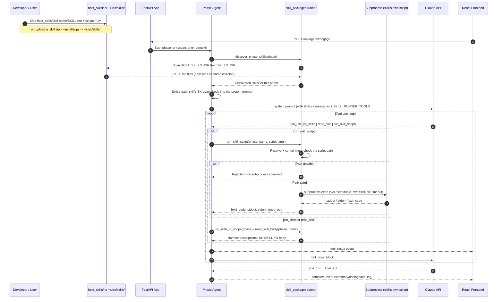

# Skill Execution Diagrams

_Updated for the skill runner (replaces the old `@skill`-decorator registry — see `skill_packages/runner.py`)._

## Diagram 1: Package + Discover + Execute Flow

```mermaid
flowchart TD
    A1[Product ships a skill] --> B1[iac-copilot-api/host_skills/skill-name/SKILL.md + scripts/*.py]
    A2[User uploads a .skill zip] --> B2[skill_packages/installer.py extracts + validates]
    B2 --> B3[~/.iac/skills/skill-name/SKILL.md + scripts/*.py]

    B1 --> C[Plain spec-compliant directory - no decorator, no Python import/registration step]
    B3 --> C

    D[FastAPI app starts] --> E[Agent routes initialized]
    E --> F[Phase agent selected by engagement phase]
    F --> G[Agent's phase tag e.g. recon]
    G --> H[discover_phase_skills&#40;phase&#41;]
    H --> H1[Scan HOST_SKILLS_DIR]
    H --> H2[Scan SKILLS_DIR &#40;user-installed&#41;]
    H1 --> H3{Name collision?}
    H2 --> H3
    H3 -->|yes| H4[Host skill wins, user copy shadowed + logged]
    H3 -->|no| H5[Both kept]

    H4 --> I[Discovered skills' SKILL.md bodies spliced into system prompt]
    H5 --> I
    I --> J[Fixed SKILL_RUNNER_TOOLS sent to LLM: list_skills, read_skill, run_skill_script]

    K[User starts engagement from UI] --> L[Frontend calls API]
    L --> M[Base agent tool loop begins]
    M --> N{LLM response type?}

    N -->|text| O[Emit text event]
    N -->|tool_use| P[Extract tool name and tool input]

    P --> Q{Which tool?}
    Q -->|list_skills| R1[Return in-scope skill names + descriptions]
    Q -->|read_skill| R2[Return that skill's full SKILL.md body]
    Q -->|run_skill_script| R3[Containment check: resolve script path, reject if outside skill dir]
    R3 --> R4{Path safe?}
    R4 -->|no| R5[Reject - no subprocess spawned]
    R4 -->|yes| R6[Execute via subprocess: sys.executable, cwd=skill dir, timeout]
    R6 --> R7[Capture exit_code / stdout / stderr / timed_out - unparsed]

    R1 --> S[Emit tool_result event]
    R2 --> S
    R5 --> S
    R7 --> S
    S --> T[Append tool_result to LLM conversation]
    T --> M

    M --> U{stop_reason == end_turn?}
    U -->|no| N
    U -->|yes| V[Build final AgentResult]
    V --> W[Return phase summary + findings + tool call log]

    subgraph Package_and_Discover
      A1
      A2
      B1
      B2
      B3
      C
    end

    subgraph Runtime_Execution
      D
      E
      F
      G
      H
      H1
      H2
      H3
      H4
      H5
      I
      J
      K
      L
      M
      N
      P
      Q
      R3
      R4
      R6
      S
      T
      U
      V
      W
    end
```

**No approval/protection gate today.** Unlike the old registry (which had a `requires_approval`/`protected` per-skill mechanism), Skill Packages have no equivalent yet — this is an explicit `# TODO` in `base_agent.py`, to be designed before any skill category needs gating (e.g. a future active-exploitation phase). Today, `run_skill_script`'s only enforcement is the path-containment check — a script actually running is not itself gated on approval.

## Diagram 2: Sequence View (UI -> API -> Agent -> Runner -> Script)

