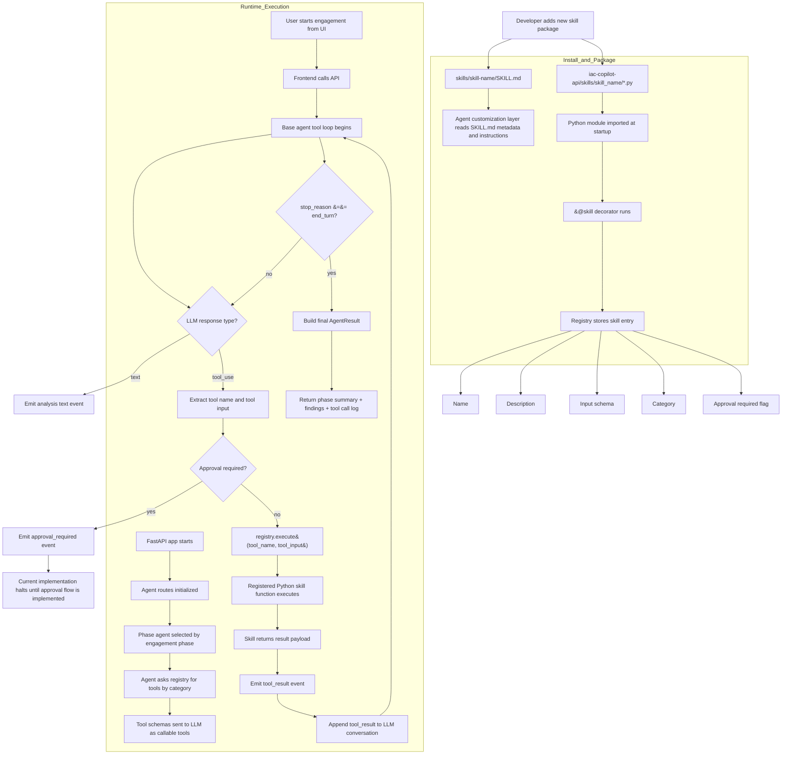
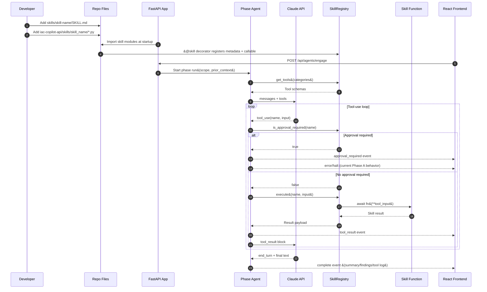

# Skill Execution Diagrams

## Diagram 1: Install + Registry + Execute Flow

```mermaid
flowchart TD
    A[Developer adds new skill package] --> B[skills/skill-name/SKILL.md]
    A --> C[iac-copilot-api/skills/skill_name/*.py]

    B --> D[Agent customization layer reads SKILL.md metadata and instructions]
    C --> E[Python module imported at startup]

    E --> F[&#64;skill decorator runs]
    F --> G[Registry stores skill entry]
    G --> G1[Name]
    G --> G2[Description]
    G --> G3[Input schema]
    G --> G4[Category]
    G --> G5[Approval required flag]

    H[FastAPI app starts] --> I[Agent routes initialized]
    I --> J[Phase agent selected by engagement phase]
    J --> K[Agent asks registry for tools by category]
    K --> L[Tool schemas sent to LLM as callable tools]

    M[User starts engagement from UI] --> N[Frontend calls API]
    N --> O[Base agent tool loop begins]
    O --> P{LLM response type?}

    P -->|text| Q[Emit analysis text event]
    P -->|tool_use| R[Extract tool name and tool input]

    R --> S{Approval required?}
    S -->|yes| T[Emit approval_required event]
    T --> U[Current implementation halts until approval flow is implemented]
    S -->|no| V[registry.execute&#40;tool_name, tool_input&#41;]

    V --> W[Registered Python skill function executes]
    W --> X[Skill returns result payload]
    X --> Y[Emit tool_result event]
    Y --> Z[Append tool_result to LLM conversation]
    Z --> O

    O --> AA{stop_reason &#61;&#61; end_turn?}
    AA -->|no| P
    AA -->|yes| AB[Build final AgentResult]
    AB --> AC[Return phase summary + findings + tool call log]

    subgraph Install_and_Package
      B
      C
      D
      E
      F
      G
    end

    subgraph Runtime_Execution
      H
      I
      J
      K
      L
      M
      N
      O
      P
      R
      S
      V
      W
      X
      Y
      Z
      AA
      AB
      AC
    end
```

## Diagram 2: Sequence View (UI -> API -> Agent -> Registry -> Skill)

```mermaid
sequenceDiagram
    autonumber
    participant Dev as Developer
    participant Repo as Repo Files
    participant API as FastAPI App
    participant Agent as Phase Agent
    participant LLM as Claude API
    participant Registry as SkillRegistry
    participant Skill as Skill Function
    participant UI as React Frontend

    Dev->>Repo: Add skills/skill-name/SKILL.md
    Dev->>Repo: Add iac-copilot-api/skills/skill_name/*.py
    API->>Repo: Import skill modules at startup
    Repo->>Registry: &#64;skill decorator registers metadata + callable

    UI->>API: POST /api/agents/engage
    API->>Agent: Start phase run&#40;scope, prior_context&#41;
    Agent->>Registry: get_tools&#40;categories&#41;
    Registry-->>Agent: Tool schemas
    Agent->>LLM: messages + tools

    loop Tool-use loop
        LLM-->>Agent: tool_use(name, input)
        Agent->>Registry: is_approval_required(name)
        alt Approval required
            Registry-->>Agent: true
            Agent-->>UI: approval_required event
            Agent-->>UI: error/halt (current Phase A behavior)
        else No approval required
            Registry-->>Agent: false
            Agent->>Registry: execute&#40;name, input&#41;
            Registry->>Skill: await fn&#40;**tool_input&#41;
            Skill-->>Registry: Skill result
            Registry-->>Agent: Result payload
            Agent-->>UI: tool_result event
            Agent->>LLM: tool_result block
        end
    end

    LLM-->>Agent: end_turn + final text
    Agent-->>UI: complete event &#40;summary/findings/tool log&#41;
```
