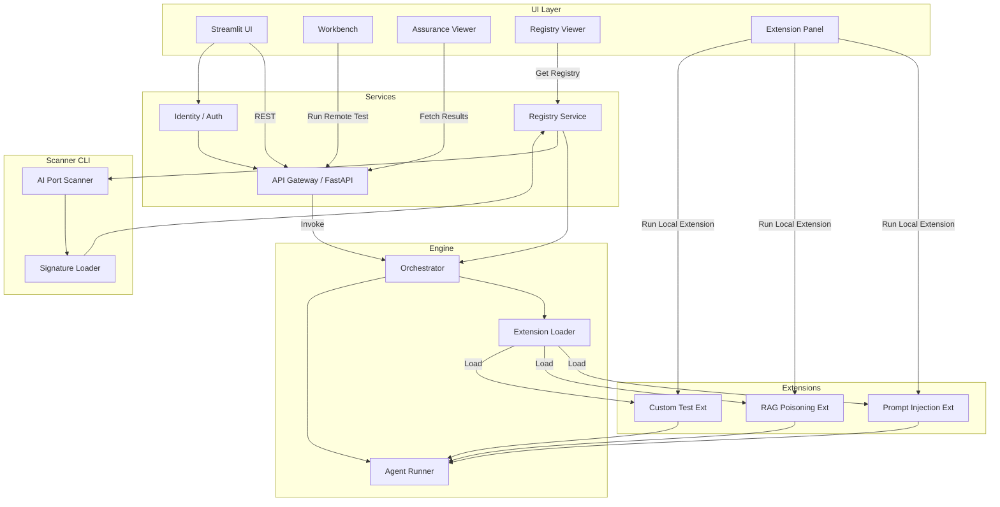

## Diagrams

### Component Diagram

```mermaid

graph TD
  subgraph UI Layer
    A[Streamlit UI]
    A1[Workbench]
    A2[Assurance Viewer]
    A3[Registry Viewer]
    A4[Extension Panel]
  end

  subgraph Services
    S1[API Gateway / FastAPI]
    S2[Registry Service]
    S3[Identity / Auth]
  end

  subgraph Engine
    E1[Orchestrator]
    E2[Extension Loader]
    E3[Agent Runner]
  end

  subgraph Extensions
    X1[Prompt Injection Ext]
    X2[RAG Poisoning Ext]
    X3[Custom Test Ext]
  end

  subgraph Scanner CLI
    C1[AI Port Scanner]
    C2[Signature Loader]
  end

  %% UI to Services
  A -->|REST| S1
  A1 -->|Run Remote Test| S1
  A2 -->|Fetch Results| S1
  A3 -->|Get Registry| S2
  A4 -->|Run Local Extension| X1
  A4 -->|Run Local Extension| X2
  A4 -->|Run Local Extension| X3

  %% Services to Engine
  S1 -->|Invoke| E1
  E1 --> E2
  E2 -->|Load| X1
  E2 -->|Load| X2
  E2 -->|Load| X3
  E1 --> E3

  %% Extensions to Agent Runner
  X1 --> E3
  X2 --> E3
  X3 --> E3

  %% Registry and Scanner
  S2 --> E1
  S2 --> C1
  C1 --> C2
  C2 --> S2

  %% Identity
  A --> S3
  S3 --> S1

```
